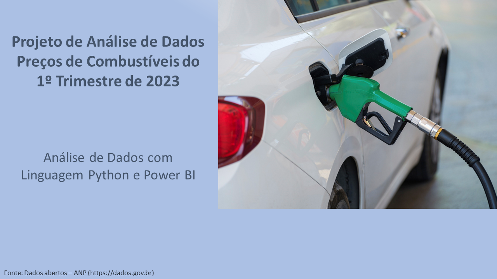

# <font color='blue'>ANÁLISE DE DADOS DO PREÇO DA GASOLINA E ETANOL</font>

## Sumário:
>**1-Descrição do Projeto**<br>
>**2-Carregando os Dados**<br>
>**3-Análise Exploratória dos Dados**<br>
>**4-Tratamento e Limpeza**<br>
>**5-Salvando Dataset após Processamento de Dados**<br>
>**6-Análise de Dados no Power BI**<br>
>**7-Relatório Final**

                                                                                                         Versão: 1.0

## 1-Descrição do Projeto



Descrição:
* O projeto consiste em analisar o preço médio do etanol, gasolina e gasolina aditivada praticada no Brasil.
* O objetivo é extrair o preço médio dos respectivos combustíveis no 1º trimestre de 2023 a nível nacional, regional e estadual, indicando os 3 estados com o maior preço médio por produto, o preço médio, o preço mínimo, o preço máximo, o preço médio regional, a variação do preço médio ao longo do tempo e a tendência do valor de venda.
* Os dados são de domínio publico e podem ser obtidos no site de dados abertos do governo brasileiro. (dados.gov.br)
* O projeto será realizado no jupyter notebook em duas etapas, onde a primeira etapa consiste em executar uma análise exploratória e o processamento dos dados com auxílio da linguagem Python e na segunda etapa apresentar uma análise visual do resultado com Power BI.

**Nota:** Os arquivos serão disponibilizados no meu repositório do Github.

## 2-Carregando os Dados


```python
# Versão da Linguagem Python utilizado neste projeto
from platform import python_version
print('Versão da Linguagem Python Usada Neste Jupyter Notebook:', python_version())
```

### 2.1-Carregando os Pacotes necessário para o projeto


```python
# Carregando as bibliotecas
import numpy as np 
import pandas as pd
import matplotlib.pyplot as plt
import seaborn as sns

import warnings
warnings.filterwarnings("ignore")
```


```python
# Versão das bibliotecas utilizadas neste projeto
%reload_ext watermark
%watermark -a "LCGentil" --iversions
```


```python
# Carregando Dados direto da Planilha Excel
dados = pd.read_excel("dados/preco_gas_etanol_2023.xlsx")
```

### 2.2-Preparação dos Dados


```python
# Verificando o Tamanho da Planilha (linhas x Colunas)
dados.shape
```


```python
# Amostra de dados
dados.head()
```


```python
# Verificando registros duplicados
dados.duplicated().sum()
```

> Não há registros duplicados neste conjunto de dados.


```python
# Excluir colunas que não contribuem para a análise
dados_tmp = dados.drop(['Revenda','CNPJ da Revenda','Nome da Rua','Numero Rua','Complemento','Cep','Bandeira'],axis =1)
```

> Remoção das colunas que contenham informações referentes a identificação e endereço, pois não serão utilizadas na análise, além de deixar o dataset mais leve para executar os scripts.


```python
# Confirmando a remoção de 7 colunas
dados_tmp.shape
```


```python
# Renomear algumas colunas para evitar erros
dados_tmp.rename(columns = {
    'Regiao - Sigla':'Regiao', 
    'Estado - Sigla':'Estado',
    'Data da Coleta':'Data_Coleta', 
    'Valor de Venda':'Valor_Venda',
    'Valor de Compra': 'Valor_Compra',
    'Unidade de Medida':'Unidade_Medida'}, inplace = 1) 
dados_tmp.head()
```


```python
# Verificando a quantidade de registros por coluna
dados_tmp.count()
```


```python
# Verificando a quantidade de resgistros por Produto antes do processamento dos dados
dados_tmp.groupby('Produto').count()
```

> Podemos constatar alterações nas colunas **Bairro** e **Valor_Compra**

## 3-Análise Exploratória dos Dados

### 3.1-Análise descritiva inicial


```python
# Resumo de informções do dataset
dados_tmp.info()
```

> Temos a informação de que o dataset é composto por variávies do tipo data,  categórica e númerica do tipo float.<br>
> Podemos identificar também que há uma anormalidade nas colunas **Bairro** e **Valor_Compra**, pois ambas possuem número de registros inferior ao número total de linhas (138.275) 


```python
# Verificação do total de valores ausentes
dados_tmp.isna().sum()
```


```python
# Verificação da Porcentagem de valores ausentes
round(dados_tmp.isnull().mean()*100,2)
```

> Foi identificado, que tanto a coluna **Bairro** quanto a coluna **Valor_Compra** possuem **valores ausentes** e que ambas deverão ser tratadas para não causar impacto no relatório final.<br>
> Porém já podemos definir que a coluna **Valor_Compra** deverá ser descartada, pois possui 100% de **valores ausentes**.


```python
# Verificando valores únicos
for col in list(dados_tmp.columns):
    
    # Obtém uma lista de valores únicos
    list_of_unique_values = dados_tmp[col].unique()
    
    # Se o número de valores exclusivos for menor que 15, imprima os valores.  
    if len(list_of_unique_values) < 15:
        print("\n")
        print(col + ': ' + str(len(list_of_unique_values)) + ' valores únicos')
        print(list_of_unique_values)
    else:
        print("\n")
        print(col + ': ' + str(len(list_of_unique_values)) + ' valores únicos')
```

> Podemos constatar que ambas as colunas **Valor_Compra** e **Unidade_Medida** possuem somente uma categoria cada.<br>
>* No caso da coluna **Unidade_Medida** todos os registros desta coluna possuem a mesma informação ("R$ / litro").<br>
>* No caso da coluna **Valor_Compra** podemos comprovar novamente que os registros estão todos vazios ("NaN").<br>


```python
# Verificando se a coluna Valor_Venda possui Preço igual a Zero
dados_tmp.loc[dados_tmp.Valor_Venda == 0]
```

> A coluna **Valor_Venda** não possui nenhum registro com valor zero

### 3.2-Verificação de Valores Outliers

 #### 3.2a-Análise de Outliers da Coluna Valor_Venda


```python
# Verificação de valores outliers da coluna Valor_Venda 
sns.boxplot(dados_tmp.Valor_Venda)
plt.title("Distribuição dos Preços dos Combustíveis\n")
plt.show()
```

> Podemos constatar a existência de valores outliers na coluna **Valor_Venda**!<br> 
Então será realizada uma análise de forma independente para cada produto (Etanol, Gasolina e Gasolina Aditivada), afim de verificar a distribuição dos preços e se os outliers irão precisar ser tratados. 

 #### 3.2b-Análise de Outliers do Produto Etanol


```python
# Criar um dataframe temporário somente com Produto Etanol
df_etanol = dados_tmp.loc[dados_tmp.Produto == 'ETANOL']
df_etanol.head()
```


```python
# Verificação de valores outliers do Produto Etanol
sns.boxplot(df_etanol.Valor_Venda)
plt.title("Distribuição dos Preços do Etanol\n")
plt.show()
```


```python
# Exibindo os maiores preços do Etanol.  
df_etanol.nlargest(15, "Valor_Venda")
```


```python
# Filtrar os valores outliers e identificar a quantidade de registros que deverão ser removidos
etanol_outlier = df_etanol.loc[df_etanol.Valor_Venda >= 6.10]
etanol_outlier.shape
```


```python
# Verficação do Tamanho do dataframe temporário
df_etanol.shape
```


```python
# Remoção dos registros outliers no dataframe temporário
df_etanol = df_etanol.drop(etanol_outlier.index)
```


```python
# Verficação do Tamanho do dataframe temporário após remoção dos outliers
df_etanol.shape
```


```python
# Verificação do Produto Etanol após tratamento de outliers
sns.boxplot(df_etanol.Valor_Venda)
plt.title("Distribuição dos Preços do Etanol\n")
plt.show()
```


```python
# Exibindo os maiores preços do Etanol após tratamento de outliers.  
df_etanol.nlargest(15, "Valor_Venda")
```

> Conclusão da análise de valores outliers do Produto Etanol:
>* Identificamos valores extremos que interferem no preço médio e optei pela remoção dos respectivos registros, pois são apenas 33 registros que representam 0,07% do total de registros de etanol (45133).
>* Utilizei como filtro o valor de 6.10 (R$/litro)
>* Neste tópico foi realizado somente a análise de valores outliers e a remoção destes registros será realizada no item de tratamente e limpeza.

 #### 3.2c-Análise de Outliers do Produto Gasolina


```python
# Criar um dataframe temporário somente com Produto Gasolina
df_gasolina = dados_tmp.loc[dados_tmp.Produto == 'GASOLINA']
df_gasolina.head()
```


```python
# Verificação de valores outliers do Produto Gasolina
sns.boxplot(df_gasolina.Valor_Venda)
plt.title("Distribuição dos Preços da Gasolina\n")
plt.show()
```


```python
# Exibindo os maiores preços do Gasolina.  
df_gasolina.nlargest(15, "Valor_Venda")
```


```python
# Filtrar os valores outliers e identificar a quantidade de registros que deverão ser removidos
gasolina_outlier = df_gasolina.loc[df_gasolina.Valor_Venda >= 7.00]
gasolina_outlier.shape
```


```python
# Verficação do Tamanho do dataframe temporário
df_gasolina.shape
```


```python
# Remoção dos registros outliers no dataframe temporário
df_gasolina = df_gasolina.drop(gasolina_outlier.index)
```


```python
# Verficação do Tamanho do dataframe temporário após remoção dos outliers
df_gasolina.shape
```


```python
# Verificação do Produto Gasolina após tratamento de outliers
sns.boxplot(df_gasolina.Valor_Venda)
plt.title("Distribuição dos Preços da Gasolina\n")
plt.show()
```


```python
# Exibindo os maiores preços do Gasolina após tratamento de outliers.  
df_gasolina.nlargest(15, "Valor_Venda")
```

> Conclusão da análise de valores outliers do Produto Gasolina:
>* Identificamos valores extremos que interferem no preço médio e optei pela remoção dos respectivos registros, pois são apenas 17 registros que representam 0,03% do total de registros de gasolina (52257).
>* Utilizei como filtro o valor de 7.00 (R$/litro)
>* Neste tópico foi realizado somente a análise de valores outliers e a remoção destes registros será realizada no item de tratamente e limpeza.

 #### 3.2d-Análise de Outliers do Produto Gasolina Aditivada


```python
# Criar um dataframe temporário somente com Produto Gasolina Aditivada
df_gasolina_adit = dados_tmp.loc[dados_tmp.Produto == 'GASOLINA ADITIVADA']
df_gasolina_adit.head()
```


```python
# Verificação de valores outliers do Produto Gasolina Aditivada
sns.boxplot(df_gasolina_adit.Valor_Venda)
plt.title("Distribuição dos Preços da Gasolina Aditivada\n")
plt.show()
```


```python
# Exibindo os maiores preços do Gasolina Aditivada.  
df_gasolina_adit.nlargest(15, "Valor_Venda")
```


```python
# Exibindo os menores preços do Gasolina Aditivada.  
df_gasolina_adit.nsmallest(15, "Valor_Venda")
```


```python
# Filtrar os valores outliers superior e identificar a quantidade de registros que deverão ser removidos
gasolina_adit_outlierHigh = df_gasolina_adit.loc[df_gasolina_adit.Valor_Venda >= 7.20]
gasolina_adit_outlierHigh.shape
```


```python
# Filtrar os valores outliers e identificar a quantidade de registros que deverão ser removidos
gasolina_adit_outlierLow = df_gasolina_adit.loc[df_gasolina_adit.Valor_Venda <= 4.10]
gasolina_adit_outlierLow.shape
```


```python
# Verficação do Tamanho do dataframe temporário
df_gasolina_adit.shape
```


```python
# Remoção dos registros outliers superior no dataframe temporário
df_gasolina_adit = df_gasolina_adit.drop(gasolina_adit_outlierHigh.index)
```


```python
# Remoção dos registros outliers inferior no dataframe temporário
df_gasolina_adit = df_gasolina_adit.drop(gasolina_adit_outlierLow.index)
```


```python
# Verficação do Tamanho do dataframe temporário após remoção dos outliers
df_gasolina_adit.shape
```


```python
# Verificação do Produto Gasolina Aditivada após tratamento de outliers
sns.boxplot(df_gasolina_adit.Valor_Venda)
plt.title("Distribuição dos Preços da Gasolina Aditivada\n")
plt.show()
```


```python
# Exibindo os maiores preços do Gasolina Aditivada após tratamento de outliers.  
df_gasolina_adit.nlargest(15, "Valor_Venda")
```


```python
# Exibindo os menores preços do Gasolina Aditivada após tratamento de outliers.  
df_gasolina_adit.nsmallest(15, "Valor_Venda")
```

> Conclusão da análise de valores outliers do Produto Gasolina Aditivada:
>* Identificamos valores extremos que interferem no preço médio e optei pela remoção dos respectivos registros, pois são apenas 67 registros que representam 0,16 % do total de registros de gasolina aditivada (40885).
>* Utilizei como filtro superior o valor de 7.20 e o filtro inferior o valor de 4,10 (R$/litro)
>* Neste tópico foi realizado somente a análise de valores outliers e a remoção destes registros será realizada no item de tratamente e limpeza.

### 3.3-Medidas de Tendencia Central

 #### 3.3c-Etanol


```python
# Descrição dos registros do Produto Etanol
round(df_etanol.describe(),2)
```


```python
# Verificando o valor que mais se repete para o Produto Etanol
df_etanol.Valor_Venda.mode()
```

> Podemos conlcuir que o valor de venda do etanol (R$ / litro) no 1º trimestre de 2023:
>* varia entre 3,03 a 5,99
>* Tem preço médio nacional de 4,07
>* O valor central do conjunto de registros é de 3,99
>* O valor mais aplicado é de 3,99 
>* Tem um desvio padrão de 0.43 indicando que a distribuição dos registros tendem a estar próximo da valor médio
>* Para esta análise foi utilizado um conjunto de 45.100 registros

 #### 3.3b-Gasolina 


```python
# Descrição dos registros do Produto Gasolina
round(df_gasolina.describe(),2)
```


```python
# Verificando o valor que mais se repete para o Produto Etanol
df_gasolina.Valor_Venda.mode()
```

> Podemos conlcuir que o valor de venda da gasolina (R$ / litro) no 1º trimestre de 2023:
>* varia entre 4,09 a 6,99
>* Tem preço médio nacional de 5,23
>* O valor central do conjunto de registros é de 5,19
>* O valor mais aplicado é de 4,99 
>* Tem um desvio padrão de 0.40 indicando que a distribuição dos registros tendem a estar próximo da valor médio
>* Para esta análise foi utilizado um conjunto de 52.240 registros

 #### 3.3c-Gasolina Aditivada


```python
# Descrição dos registros do Produto Gasolina
round(df_gasolina_adit.describe(),2)
```


```python
# Verificando o valor que mais se repete para o Produto Etanol
df_gasolina_adit.Valor_Venda.mode()
```

> Podemos conlcuir que o valor de venda da gasolina (R$ / litro) no 1º trimestre de 2023:
>* varia entre 4,19 a 7,09
>* Tem preço médio nacional de 5,41
>* O valor central do conjunto de registros é de 5,39
>* O valor mais aplicado é de 5,19 
>* Tem um desvio padrão de 0.41 indicando que a distribuição dos registros tendem a estar próximo da valor médio
>* Para esta análise foi utilizado um conjunto de 40.818 registros

## 4-Tratamento e Limpeza

### -Tratamento de valores ausentes


```python
# Excluir colunas que não contribuem para a análise
dados_tmp2 = dados_tmp.drop(['Valor_Compra','Unidade_Medida'],axis =1)
```

> Colunas com valores constantes ou completamente vazias não contribuem para análise, então ambas as colunas deverão ser desconsideradas.


```python
dados_tmp2.shape
```

### -Tratamento de Valores ausentes na coluna Bairro pelo metodo de inputação


```python
# Total de valores ausentes na coluna Bairro antes do tratamento
dados_tmp2.Bairro.isna().sum()
```


```python
# Imputação de valores 'sem nome' nos registros ausentes. 
dados_tmp2.Bairro.fillna('sem nome', inplace = True)
```


```python
# Total de valores ausentes na coluna Bairro após o tratamento
dados_tmp2.Bairro.isna().sum()
```


```python
# Total de inputação da string 'sem nome' na coluna Bairro
dados_tmp2.Bairro.isin(['sem nome']).sum()
```

> Foram substituidos 316 valores ausentes pela informação 'sem nome' na coluna **Bairro**

### -Tratamento de Valores Outlies


```python
# Verificando o tamanho do dataframe antes da remoção dos outliers no conjunto de dados
dados_tmp2.shape
```


```python
# Remoção dos registros outliers do Produto Etanol no conjunto de dados
dados_tmp3 = dados_tmp2.drop(etanol_outlier.index)
dados_tmp3.shape
```


```python
# Remoção dos registros outliers do Produto Gasolina no conjunto de dados
dados_tmp4 = dados_tmp3.drop(gasolina_outlier.index)
dados_tmp4.shape
```


```python
# Remoção dos registros outliers superior do Produto Gasolina Aditivada no conjunto de dados
dados_tmp5 = dados_tmp4.drop(gasolina_adit_outlierHigh.index)
dados_tmp5.shape
```


```python
# Remoção dos registros outliers inferior do Produto Gasolina Aditivada no conjunto de dados
dados_tmp6 = dados_tmp5.drop(gasolina_adit_outlierLow.index)
dados_tmp6.shape
```

>Foram removidos um total de 117 registros outliers

## 5-Salvando o Dataset após Processamento de Dados


```python
# Verificando a quantidade de resgistros por Produto após o processamento dos dados
dados_tmp6.groupby('Produto').count()
```


```python
df = dados_tmp6
```


```python
df.head()
```


```python
# Salva a tabela processada no formato CSV para analise no Power BI
df.to_csv('dados/preco_tratado.csv', index = False)
```

## 6-Análise de Dados no Power BI

<p>Apartir dos dados processados previamente foi elaborado um relátorio no Power BI, com o auxilio de gráficos, expressões DAX (Expressões de Análise de Dados) e títulos dinâmicos.</p>
<br>Segue abaixo um dashboard com uma visão geral do relarório, onde podemos observar o preço médio dos combustíveis (Etanol, Gasolina e Gasolina Aditivada).
<br>O relatório abrange nível de detalhes hierárquicos, em que podemos visualizar as informações no nível nacional, regional e estadual.Também podemos analisar o preço médio ao longo do tempo e sua respestiva tendência.


**Nota:** Lembrando que os dados são de domínio público e refence-se ao 1º Trimestre de 2023


#### Descrição do Dashboard:<br>
O relatório do Power BI é dinâmico, ao selecionar um item os outros gráficos irão exibir a informação do respectivo item, por exemplo: Se o estado do Rio de Janeiro for selecionado os outros gráficos irão exibir as informações do Rio de Janeiro.


* 1- Mapa do Brasil, onde é possivel selcionar o estado desejado. Um click para selecionar e um click no item selecionado para desmarcar
* 2- Exibe o preço médio por região. Um click na sigla da região para selecionar
* 3- Exibe os 3 estados com maior preço médio de cada produto¹
* 4- Exibe o preço mínimo (canto esquerdo), preço médio (central) e o preço máximo (canto direito) de cada produto
* 5- Exibe o preço médio ao longo do tempo podendo ser visualizado em meses ou dias
* 6- Exibe a tendencia do preço médio 

<br>**Nota1:** Os gráficos do 'top 3 estados com maior preço médio' são fixos e não interagem com os filtros.


Segue a visualização do preço médio de cada produto por região:
* CO - Centro Oeste
* N - Norte
* NE - Nordeste
* S - Sul
* SE - Sudeste


Segue a visualização do preço médio de cada produto por estado


A seguir podemos observar a navegação da variação do preço médio através da hierarquia, para isso basta clicar no ícone destacado 'Expandir todo o campo um nível abaixo na hierarquia' para alterar o modo de visualização de variação mensal para variação diária.

O nível de detalhe hierarquico também está disponível para o gráfico de tendência (Média Móvel)

**Nota:** Na parte inferior do próprio gráfico será exibido uma barra de rolagem, que permite a visualização de toda a extensão do gráfico ao deslizar para esquerda ou para direita.


Para subir a hierarquia para visualização mensal, basta clicar no ícone destacado 'Fazer drill up'.


## 7-Relatório Final

**1-Análise do panorama nacional:**<br>
-Podemos constatar que no 1º trimestre de 2023 há uma tendência de aumento de preço nos 3 três produtos avaliados, sendo que na gasolina e gasolina aditivada tendendo para um aumento mais expressivo e já no etanol houve um aumento menos expressivo se aproximando da estabilidade.<br>
<br>-Houve aumento de preço nos combustíveis em todo o território nacional no mês de março em comparação ao mês de fevereiro:
* aumento de +8,03% para Gasolina
* aumento de +7,95% para Gasolina Aditivada 
* aumento de +2,99% para Etanol

**Nota:** A única exceção seria o estado do Amapá onde o preço médio do etanol teve uma leve queda de -0,57%  no mês de  março em comparação ao mês de fevereiro de 2023. Porém há em alguns estados, em especial da região norte, períodos sem coleta de dados no mês de março, inclusive o estado do Amapá é um deles, portanto não podemos afirmar que houve realmente queda no preço médio do etanol no Amapá.<br>

**2-Análise do panorama regional:**<br>
-Seguindo a tendência nacional todas as regiões do Brasil tiveram aumento no preço médio nos combustíveis.<br>
-Das regiões do Brasil, a região norte é a que apresentou o maior preço médio, seguido pela região nordeste.<br>
-Segue a classificação das regiões com maior preço médio segmentado por produto

|Rank |Etanol|Gasolina|Gasolina Aditivada|
|:-:|:-:|:-:|:-:|
|1  | Norte | Norte | Norte |
|2  | Sul | Nordeste | Nordeste |
|3  | Nordeste | Sul | Sul |
|4  | Sudeste | Centro Oeste | Sudeste |
|5  | Centro Oeste | Sudeste | Centro Oeste |

**3-Análise do panorama estadual**<br>
-Ao analisar os estados baseado no Top3 podemos confirmar a tendência observada no panorama regional, em que os estados com maior preço médio de gasolina e gasolina aditivada estão localizados nas regiões norte e nordeste. Os maiores preços médios do etanol estão distribuidos nas regiões norte e sul.<br>

-Com uma análise mais aprofundada na base de dados podemos afirmar que 1/3 da classificação, ou seja, nas nove (9) primeiras colocações prevalecem as regiões norte e nordeste ao que se refere ao preço médio da gasolina e gasolina aditivada. Já o etanol possui no Top9 uma distribuição mais ampla nas regiões norte, nordeste e sul.<br>


**Conclusão**<br>
Podemos concluir que no mês de março de 2023 ficou mais caro abastecer os automóveis no Brasil, principalmente nas regiões Norte e Nordeste.

# FIM
